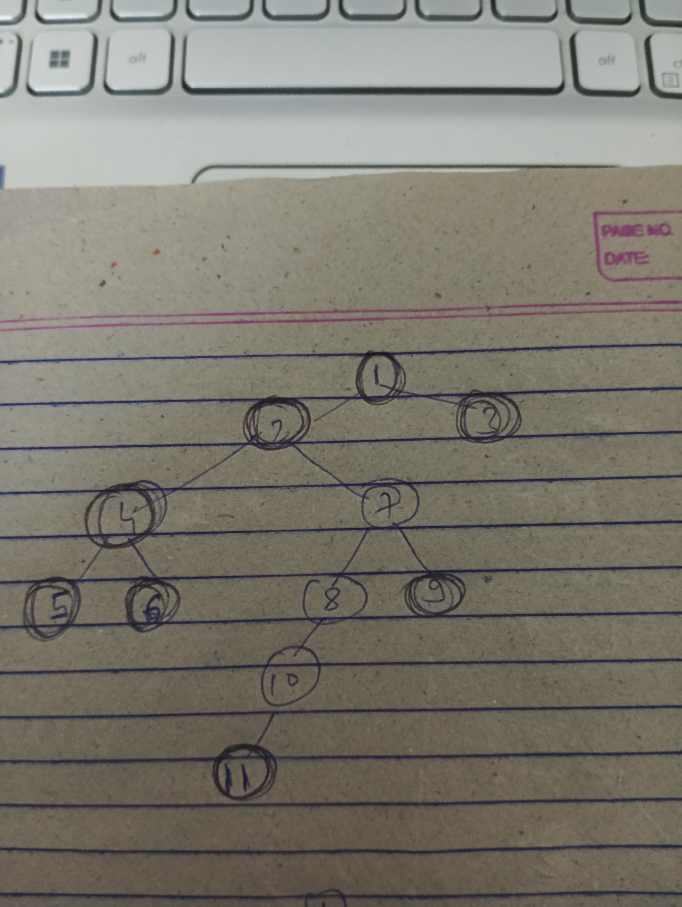

- left view vs left boundary mai problem ho rhi hai, and we can not check kiuki boundary traversal is premium question on leetcode.
- toh its better that you know both the ways. ab interviewer se pooch lena ki voh ans kesa expect kr rha hai 
- see this image
- 
- is image mai agar 1-2-4-5-6-11-9-3 chaiye toh ye boundary traversal se aaya hai left boundary(1,2,4,5) and leaves(5,6,11,9,3) and right boundary().
- agar left view poocha hota toh toh 10 bhi aata hai, left view mai har level ki leftmost node chaiye. Ab boundary mai kya chaiye voh dekh lena 
- ek way hai ki (left node right) jaao and har level ka leftmost ko hashmap mai add krdo, jise baad mai update mat kro
- doosra way ye hai ki left child hai toh left jaao else right jaao.
- saare view vale question mai hashmap mai har level ka left/right, or har horizontal level ka top/bottom daalna hai.